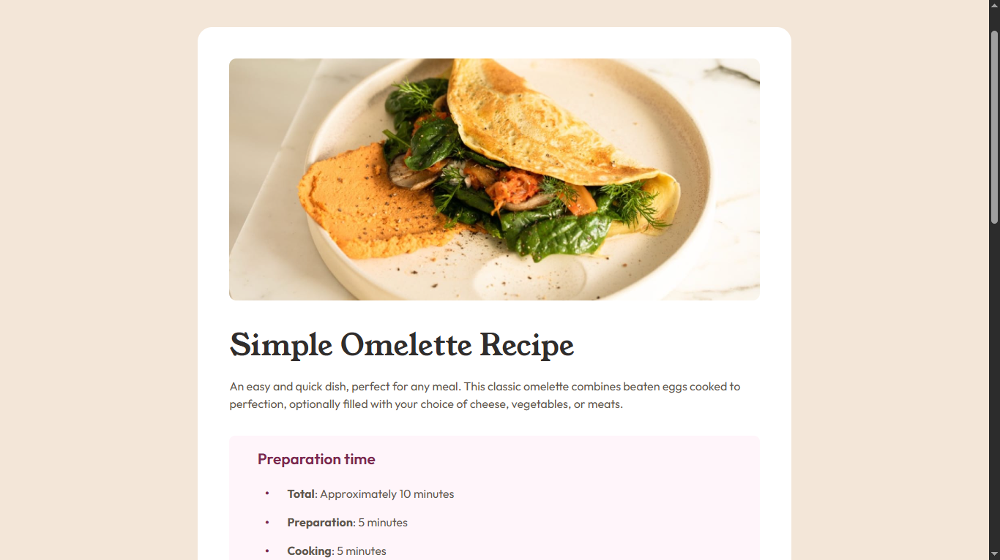

# 🍽️ Recipe Page

  

A responsive recipe page built with HTML and CSS as part of a Frontend Mentor challenge.

## 📖 About the Challenge

This project is a solution to a Frontend Mentor challenge focused on building responsive layouts using semantic HTML and CSS.

## ✨ Highlights

- 📱 Responsive layout.
- 🧱 Semantic HTML.
- 🎨 Clean and maintainable CSS.
- 📐 Pixel-conscious implementation based on the provided design.

## 🛠️ Built With

  

## 💡 Key Takeaways

Throughout this project, I practiced:

- Structuring pages with semantic HTML.
- Building responsive layouts.
- Writing clean and organized CSS.
- Turning a design into a functional webpage.

## 🔗 Links

- 🌐 **Live Site:** https://frontend-mentor-recipe-page-psi.vercel.app/
- 💻 **Repository:** https://github.com/Ziad-mo205/Frontend-Mentor---Recipe-Page
- 🎯 **Frontend Mentor Solution:** *(https://www.frontendmentor.io/solutions/responsive-recipe-page-using-media-query-8O6PSC1mOI)*